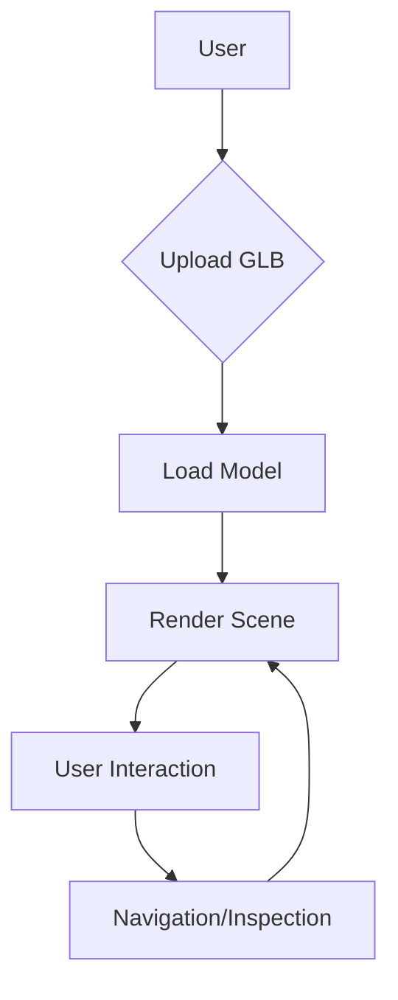

```markdown
# 🚀 threejs-demo by parthks ✨

```ascii
                                  _.--""--._
                                 .'          `.
                                /   O      O   \
                               |    \  ^^  /    |
                                \     `----'     /
                                 `. _______ .'
                                   //_____\\
                                  (( ____ ))
                                   `-----'
                    Showcasing a simple 3D model viewer built with Three.js
```

[](https://github.com/parthks/threejs-demo/blob/main/LICENSE)
[](https://www.npmjs.com/package/three)
[](https://reactjs.org/)
[](https://www.typescriptlang.org/)


---

## 🌟 Feature Highlights 💫

*   🚀 **GLB Model Loading:** Seamlessly loads and renders `.glb` 3D models.
*   🎮 **Interactive Exploration:** Use WASD/Arrow keys and mouse to navigate and inspect the model.
*   🎨 **Customizable Camera:** Adjust camera speed for optimal viewing experience.
*   📈 **Responsive Design:** Adapts to different screen sizes and devices.
*   🛠️ **Easy-to-use Interface:** Intuitive drag-and-drop functionality for model upload.
*   💡 **Progress Indicator:** Shows model loading progress.


---

## 🛠️ Tech Stack 📦

| Technology       | Badge                                                                     |
|-------------------|-----------------------------------------------------------------------------|
| Node.js          | [](https://nodejs.org/) |
| React            | [](https://reactjs.org/) |
| TypeScript       | [](https://www.typescriptlang.org/) |
| Three.js         | [](https://threejs.org/) |
| @react-three/fiber | [](https://github.com/pmndrs/react-three-fiber) |
| @react-three/drei | [](https://github.com/pmndrs/drei)|


---

## 🚀 Quick Start ⚡

1.  Clone the repository: `git clone https://github.com/parthks/threejs-demo.git`
2.  Navigate to the project directory: `cd threejs-demo`
3.  Install dependencies: `npm install`
4.  Run the development server: `npm run dev`

---

## 📖 Detailed Usage 📚

This application allows users to upload and view 3D models in `.glb` format.  The model is loaded using Three.js and displayed within a canvas. The user can navigate the scene using WASD keys or arrow keys for movement, and space/shift for vertical movement. Clicking the canvas enables mouse look controls for rotation.

**Code Example (App.tsx):**

```javascript
// ... (Import statements) ...

function App() {
  // ... (State variables and handlers) ...

  return (
    <div className="app-root" onDrop={handleDrop} onDragOver={(e) => e.preventDefault()}>
      {/* ... (UI elements) ... */}
      <Canvas dpr={pixelRatio} camera={{ position: [0, 1.6, 3], near: 0.01, far: 2000 }}>
        {/* ... (Three.js scene setup) ... */}
      </Canvas>
      {/* ... (Dropzone) ... */}
    </div>
  );
}

export default App;
```

---

## 🏗️ Project Structure 📁

```
threejs-demo/
├── src/
│   ├── App.tsx
│   ├── index.css
│   └── main.tsx
├── package.json
├── vite.config.ts
└── ...
```

---

## 🎯 API Documentation 📊

| Function          | Description                                                                 | Parameters                               | Return Value     |
|----------------------|-----------------------------------------------------------------------------|-------------------------------------------|--------------------|
| `onFileSelected` | Handles the selection of a GLB file and updates the state.               | `file: File`                               | `void`             |
| `handleDrop`       | Handles dropping a GLB file onto the canvas.                               | `e: React.DragEventHandler`               | `void`             |
| `handleBrowse`     | Handles browsing and selecting a GLB file using the file input.             | `e: React.ChangeEventHandler`             | `void`             |


---

## 🔧 Configuration Options ⚙️

| Option           | Type    | Default | Description                                                                   |
|--------------------|---------|---------|-------------------------------------------------------------------------------|
| `dpr`             | `number` | `1.25`  | Device Pixel Ratio; scales render resolution.                               |
| `movementSpeed`   | `number` | `10`    | Camera movement speed.                                                        |


---

## 📸 Screenshots/Demo 🖼️

(Markdown doesn't support image embedding directly;  replace this section with descriptions of screenshots or a link to a hosted demo.)

>  Imagine stunning screenshots here showcasing the application's functionality.


---

## 🤝 Contributing Guidelines 🤝

1.  Fork the repository.
2.  Create a new branch.
3.  Make your changes.
4.  Test your changes thoroughly.
5.  Submit a pull request.


---

## 📜 License and Acknowledgments 📜

This project is licensed under the [MIT License](https://opensource.org/licenses/MIT).  Thanks to the Three.js and React Three Fiber communities for their excellent work!


---

## 👥 Contributors 🎉

(Add contributor information here with links to their profiles)


---

## 📞 Support and Contact 📧

For any questions or issues, please contact [parthks](mailto:your_email@example.com).



```

